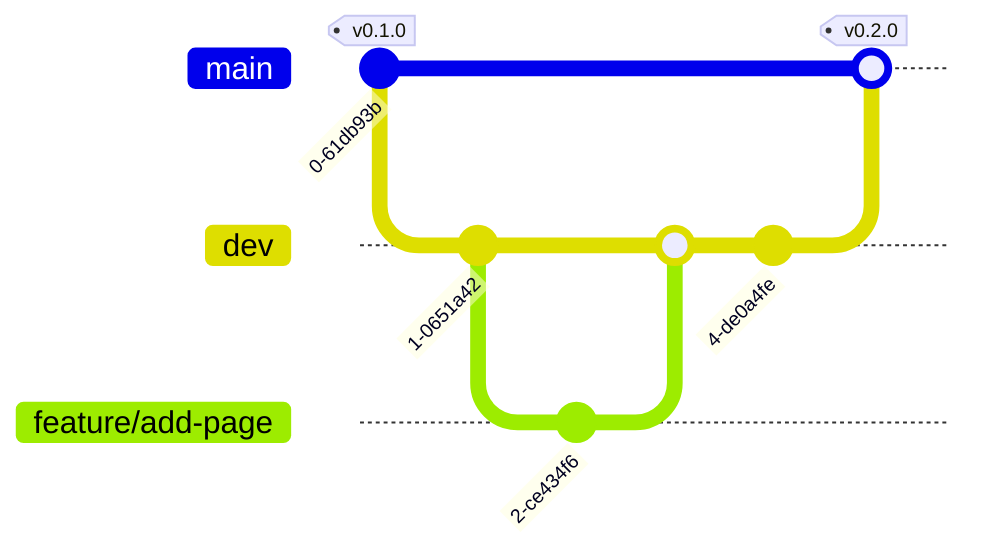

# Contributing

Thank you for contributing! This page explains the branching model, the commit
convention, and — important for this repository — the difference between
contributing **to this template** and working **in a module created from it**.

## Two layers: this template vs. your module

This template repository itself is maintained on a `main`/`dev` model and
released with **SemVer via Release Please on `main`**; a module **created from**
it is released only via the MII Module Release Workflow (**CalVer
`YYYY.n.n`**), and the first-run bootstrap removes the Release Please files
from the new module so the two release systems never mix. The rest of this page
describes contributing to **this template repository**; the full operational
model for both layers will be documented in `docs/WORKFLOWS.md` (planned).

## Branching model

Two long-lived branches, short-lived working branches:

- **`main` — stable release branch.** Always in a released, buildable state;
  every commit on `main` corresponds to a released (or release-ready) version.
  Protected: no direct pushes, pull requests require one approval. `main` is
  the **default branch**, so it is what visitors and "Use this template" users
  see first.
  > **Why main is default:** novices should land on, and start from, the
  > stable state — not work-in-progress.
- **`dev` — integration branch, unstable.** Where reviewed changes accumulate
  between releases; may be temporarily broken. Protected: changes arrive only
  via pull request. CI preview builds run here.
- **`feature/*`, `change/*`, `fix/*` — short-lived working branches.** Branched
  **off `dev`**, one focused change each, merged back into `dev` via PR, then
  deleted. Name them descriptively (`feature/add-terminology-page`,
  `fix/footer-contrast`).
  > **Why short-lived off dev:** long-running branches diverge and become
  > painful to merge; small branches keep review cheap and history legible.

> Reads as: work happens on short-lived `feature/*` off `dev`; `dev`
> integrates; `dev → main` is the release, tagged by Release Please on `main`.

### Flow — making one change

1. Branch `feature|change|fix/<topic>` off `dev`.
2. Commit using Conventional Commits (cheat-sheet below); open a PR
   **targeting `dev`**.
3. On green CI + review, **squash-merge** into `dev` (one clean Conventional
   Commit per change), delete the branch.
4. To release: open a **`dev` → `main` PR** (the release-candidate gate, a
   human-in-the-loop point). Merge it as a **merge commit, not a squash**, so
   the individual Conventional Commits reach `main`. Release automation then
   runs on `main`.
   > **Why a merge commit for dev → main:** Release Please builds the
   > changelog from the individual Conventional Commits on `main`. Squashing
   > `dev → main` would collapse the changelog to one line.

## Conventional Commits — cheat-sheet

Every commit message (and PR title, since PRs are squash-merged) follows
[Conventional Commits](https://www.conventionalcommits.org/en/v1.0.0/):
`<type>: <short description>` — for example `feat: add terminology page`.

| Type | Use for | Release effect (SemVer) |
| --- | --- | --- |
| `feat` | A new capability | Minor bump |
| `fix` | A bug fix | Patch bump |
| `docs` | Documentation only | None |
| `chore` | Maintenance (configs, housekeeping) | None |
| `ci` | CI workflow changes | None |
| `refactor` | Code restructuring, no behavior change | None |
| `test` | Adding or fixing tests | None |

Breaking change: add `!` after the type (`feat!: …`) and explain the break in
the commit body — this triggers a major bump.

> **Why Conventional Commits:** the release automation reads them to compute
> the next version and to write the changelog. A wrong type means a wrong
> version bump.

## Pull request expectations

- One focused change per PR; keep diffs reviewable.
- PRs target `dev` (never `main` directly; `main` only receives `dev` via the
  release PR).
- CI must be green before merge.
- Please follow the [Code of Conduct](CODE_OF_CONDUCT.md).

## Working in a module created from this template

If you created a repository via "Use this template", you are working in a
**module**, not in this template. The same branching model applies there
(after the first-run bootstrap creates `dev` — see the README's Quickstart
warning), but the release process is the **MII CalVer Module Release
Workflow**, not Release Please. Module recipes will live in `docs/recipes/`
(planned); improvements to the scaffold itself belong here, as PRs to this
repository.
